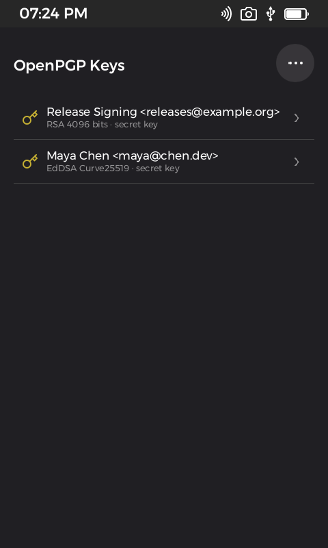
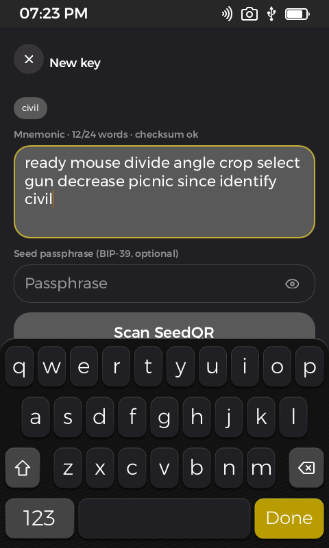

#  OpenPGP Keys

**Security · OpenPGP** — a complete OpenPGP key manager that lives where your keys belong: on secure hardware, offline.

OpenPGP Keys turns your Passport Prime into a personal certificate authority. Create keys, import the ones you already have, sign and encrypt files, and answer signing requests over nothing but QR codes — all on a device with no network stack and storage encrypted by your PIN. Best of all: keys can be **derived from a seed you import** — type in (or scan) a 12- or 24-word BIP-39 seed phrase, with an optional seed passphrase, and the app derives an OpenPGP identity from it. The words themselves are never stored: only a re-import of the same words (and passphrase) ever recreates the same keys, on this device or a future one, so your backup is the words, not the device.

<p align="center">
  
  &nbsp;
  
  &nbsp;
  
</p>

## Features

- **Create keys** — random Ed25519 (modern & fast — the pre-selected default), RSA (2048/3072/4096), NIST P-256/P-384/P-521, or an experimental **post-quantum hybrid** (Ed25519 signing + ML-KEM-768+X25519 encryption, RFC 9980), or **"From seed"** (Ed25519 or P-521): import a 12- or 24-word BIP-39 seed phrase once (typed, or scanned as a SeedQR), with an optional seed passphrase, and every account number after that derives its own key. The same words + passphrase + account number always re-create the same key and fingerprint — on this device, or on a future OpenPGP Keys build elsewhere — because the derivation is a published, cross-platform recipe rather than an implementation detail of this app. If you'd rather not expose your main seed to another app, import a [BIP-85](https://github.com/bitcoin/bips/blob/master/bip-0085.mediawiki) child mnemonic instead — any wallet that supports BIP-85 can hand you one. A **"Forget seed"** action wipes the imported root from the device at any time; it only removes the app's ability to derive *new* keys from those words — keys you've already derived are ordinary keys and are unaffected. New keys expire in **2 years by default** (3 months to 10 years or never, your choice); expiration is a self-signature you can extend anytime, so it never threatens the key itself.
- **Import anything standard** — armored `.asc` files (public or secret) from Internal, Airlock, or USB. RSA, DSA/ElGamal, ECDSA/ECDH, Ed25519 all parse, multi-key files work, and importing a public copy never downgrades a stored secret key.
- **Inspect and edit** — fingerprints, subkeys, user IDs, expiration at a glance; extend or clear expiration, add/remove user IDs, change or remove the passphrase — all as proper self-signature rebuilds that GnuPG verifies.
- **Sign files** — pick any file on the device and get a detached `.sig` next to it, identical to `gpg --detach-sign` output and verifiable anywhere.
- **Sign over QR** — a fully air-gapped signing loop: scan data with the device camera (single QR or animated multi-part UR), approve, and the signature comes back as a QR on the screen. Data in by camera, signature out by display — no cable, ever.
- **Encrypt & decrypt files** — output is exactly what `gpg -e` produces and `gpg -d` reads, with an optional embedded signature. Encrypt to any stored key, including public-only recipient keys.
- **Export safely** — public-only by default; full secret export sits behind a danger confirmation.
- **GnuPG-interoperable by proof** — the test suite round-trips keys, signatures, and encrypted files through a real `gpg` to hold the compatibility line.

Keys live as armored files on Internal storage — on hardware, a volume encrypted with PIN-derived keys — and secret keys keep their own OpenPGP passphrase layer on top. There is no keyserver access and no background sync: key material only moves when you explicitly import or export it.

## Install on your Passport Prime

Grab the **`.app` archive** from the [latest release](https://github.com/ByteApps/prime-openpgp-keys/releases/latest), copy it to a USB drive or the Airlock, and install it from **Settings > Apps > Install App** (KeyOS 1.4 or later).

The first ByteApps app you install also needs our publisher certificate trusted once: download [`byteapps.crt`](https://byteapps.com/byteapps.crt) (also attached to every release), copy it over the same way, and add it under **Settings > Apps > Allowed Publishers**. Before trusting it, check that its fingerprint matches the one published at [byteapps.com](https://byteapps.com/#verify):

```
1bca27c8e765a77fd44922bc058b815b46e627d68f2996e8c38ca6997b6be6f9
```

## Get it running

With the Foundation SDK installed, build and launch in the simulator with:

```bash
foundation sim
```

## Learn more

- [THIRD-PARTY.md](THIRD-PARTY.md) — libraries this app is built on

## Support

If this app is useful to you, a small bitcoin donation is always appreciated — entirely optional.

<div align="center">


**`bc1qkmg7qek6vuuw6hqp9sm06krzcr7pwd5jhcr43f`**

</div>

Donations help cover development costs and keep more open-source bitcoin tools coming. No VC funding, no ads, no tracking.

## License & disclaimer

Licensed under the GNU General Public License v3.0 or later — see [COPYING](COPYING). Sections 15–17 of that license disclaim all warranty and limit liability; the notes below restate that in plain language.

The **`pgp-core/`** library inside this repository carries its own, more permissive terms: **MIT OR Apache-2.0**, see [`pgp-core/LICENSE-MIT`](pgp-core/LICENSE-MIT) and [`pgp-core/LICENSE-APACHE`](pgp-core/LICENSE-APACHE). It holds the OpenPGP key operations, and the split is deliberate — other projects, including non-GPL peers of this app, are meant to build on that crate. The GPL above covers the application around it.

This is experimental software and it has **not been independently audited**.
It is provided **"as is", without warranty of any kind**, express or implied,
including but not limited to the warranties of merchantability, fitness for a
particular purpose, and non-infringement.

**Use it at your own risk.** To the maximum extent permitted by law, in no
event shall the authors, copyright holders, or contributors be liable for any
claim, damages, or other liability — including, without limitation,
**loss of keys, loss of encrypted data, or any other loss of data** — whether in an action of contract, tort, or
otherwise, arising from, out of, or in connection with this software or its
use.

Nothing in this project is financial, investment, legal, or tax advice. You
are solely responsible for verifying addresses, amounts, fees, and backups
before moving funds, and for complying with the laws of your jurisdiction.
Test on test networks, or with amounts you can afford to lose, first.

If a private key is lost, or its passphrase forgotten, **data encrypted to it is unrecoverable** — there is no reset or recovery service. Verify key fingerprints out-of-band before trusting an imported key or encrypting to it.
